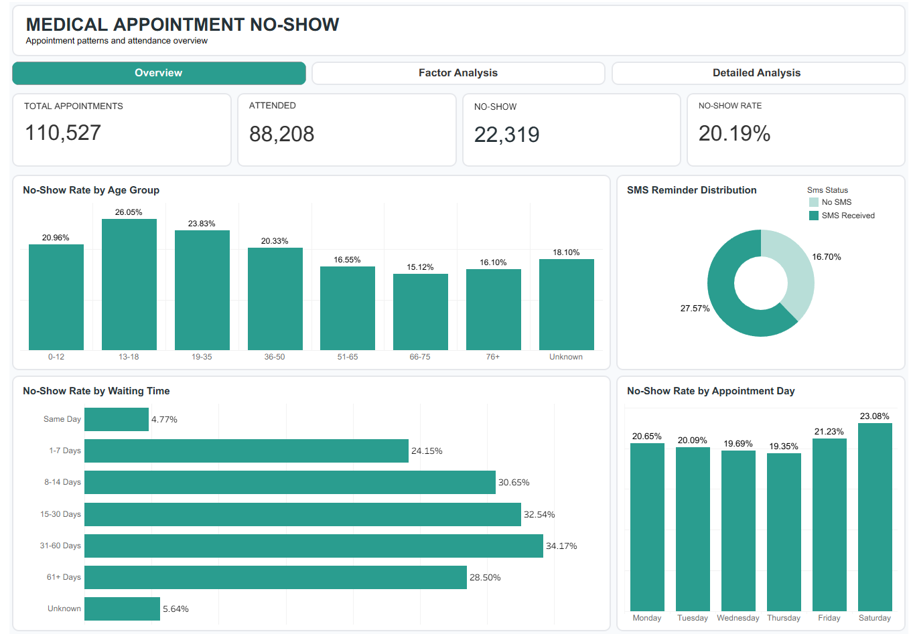
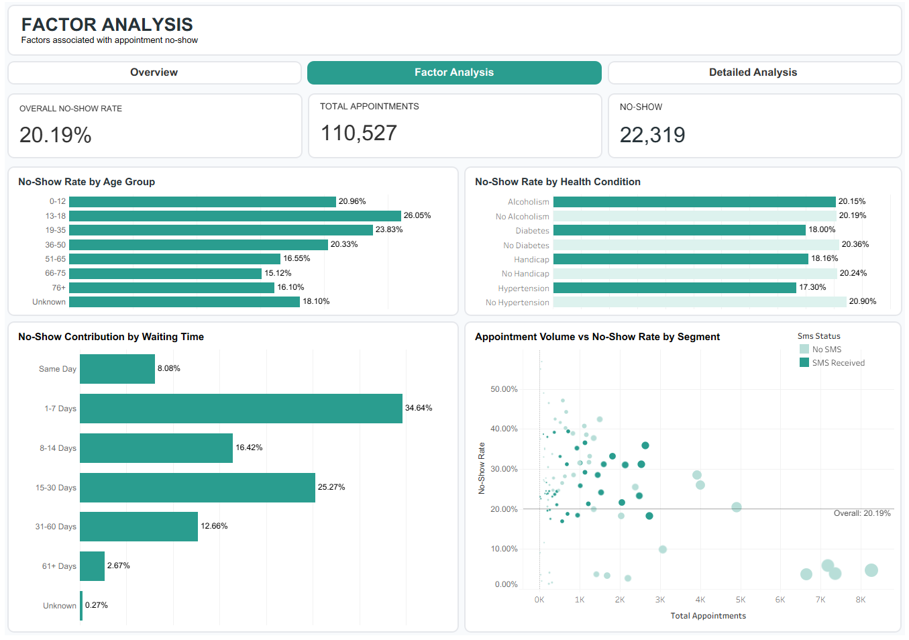
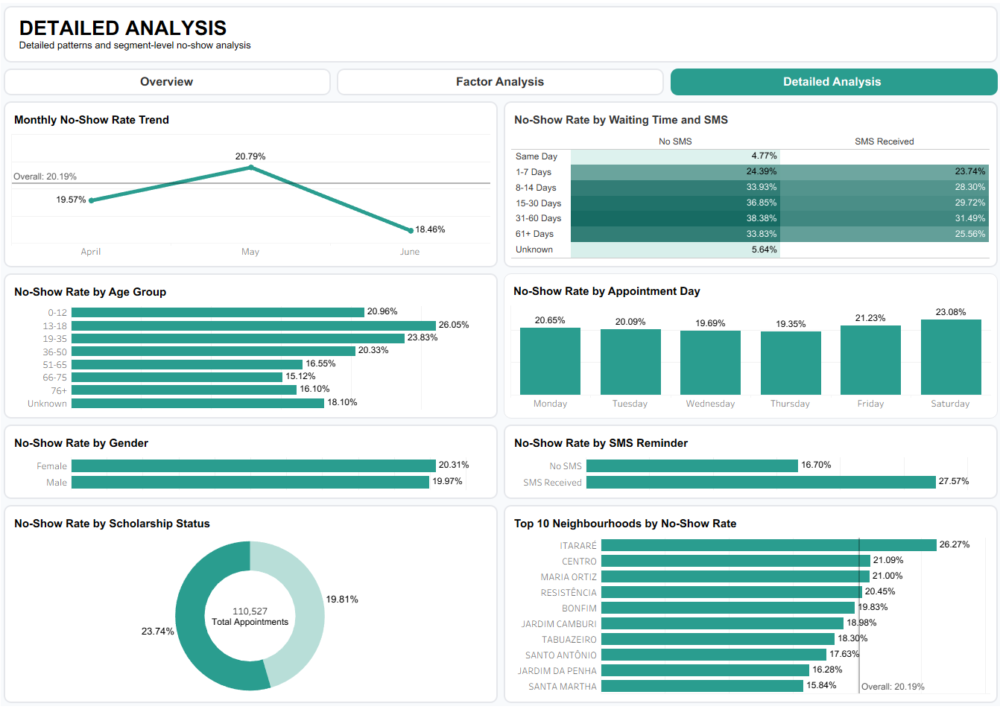

# Medical Appointment No-Show Analysis

## Overview

This project analyzes patterns of missed medical appointments (no-shows) using Python, MySQL, and Tableau Public. The workflow covers data preparation, exploratory SQL analysis, validation, statistical testing, insight generation, and interactive dashboard development.

The final analytical dataset contains **110,527 appointment records**, including **88,208 attended appointments** and **22,319 no-shows**, for an overall no-show rate of **20.19%**.

The Tableau workbook contains three dashboards:

1. **Overview** — high-level attendance and no-show patterns.
2. **Factor Analysis** — demographic, health, waiting-time, and segment comparisons.
3. **Detailed Analysis** — time, gender, SMS, scholarship, age, neighbourhood, and interaction analysis.

## Business Problem

Missed medical appointments can reduce appointment availability and create operational inefficiencies. This project investigates which appointment and patient characteristics are associated with different no-show patterns.

The analysis is descriptive and statistical; observed relationships should not be interpreted as proof of causation.

## Objectives

- Measure overall attendance and no-show rates.
- Identify no-show patterns across waiting time, age, gender, SMS reminders, scholarship, and health conditions.
- Compare groups against the overall no-show baseline.
- Explore interactions between multiple factors.
- Analyze neighbourhood-level patterns with sample-size considerations.
- Build interactive dashboards for exploratory analysis.

## Dataset

The dataset contains appointment dates, scheduling dates, demographic variables, service-related variables, health-condition indicators, neighbourhood, and appointment outcomes.

### Main analytical fields

| Field | Description |
|---|---|
| `appointment_day` | Appointment date/time |
| `scheduled_day` | Scheduling date/time |
| `waiting_days` | Difference between appointment and scheduling dates |
| `waiting_group` | Waiting-time buckets |
| `age` | Patient age |
| `age_group` | Age buckets |
| `gender_status` | Female / Male status |
| `neighbourhood` | Patient neighbourhood |
| `sms_status` | No SMS / SMS Received |
| `scholarship_status` | No Scholarship / Scholarship |
| `hypertension_status` | Hypertension / No Hypertension |
| `diabetes_status` | Diabetes / No Diabetes |
| `alcoholism_status` | Alcoholism / No Alcoholism |
| `handicap_status` | Handicap / No Handicap |
| `no_show_binary` | Binary appointment outcome |
| `no_show_status` | Attended / No-Show |

The raw, processed, and final datasets are kept in the local `data/` directory. Redistribution should follow the applicable dataset license or usage terms.

## Tools & Technologies

- **Python / Jupyter Notebook** — data cleaning and preparation.
- **MySQL** — querying, transformation, validation, and statistical analysis.
- **Tableau Public** — interactive dashboards.
- **Git / GitHub** — version control and portfolio presentation.

## Data Preparation

```text
Raw.csv
   ↓
01_Medical_Appointment_Data_Cleaning.ipynb
   ↓
Processed.csv
   ↓
MySQL transformation + analysis
   ↓
Final.csv
   ↓
Tableau
```

The final analytical view preserves the appointment-level grain:

> **1 row = 1 appointment**

Validation confirmed:

- **110,527 total rows**
- **88,208 attended**
- **22,319 no-shows**
- **20.19% overall no-show rate**

Waiting-time anomalies, categorical distributions, health fields, and row-level reconciliation were also checked.

## SQL Analysis

The SQL workflow is organized as:

```text
01_setup.sql
      ↓
02_analysis.sql
      ↓
03_final_view.sql
      ↓
04_validation.sql
      ↓
05_statistical_analysis.sql
      ↓
06_insight_analysis.sql
```

Analysis coverage includes:

- Overall appointment and no-show distribution.
- Gender and age-group analysis.
- Waiting-time analysis.
- SMS reminder analysis.
- Scholarship analysis.
- Hypertension, diabetes, alcoholism, and handicap analysis.
- Neighbourhood analysis.
- Interaction analysis such as waiting time × age and waiting time × SMS.
- No-show contribution by waiting-time group.
- Chi-square tests with effect-size calculations for selected categorical factors.
- Insight and segmentation queries prepared for Tableau.

## Tableau Dashboard

### 1. Overview

Covers:



- Total appointments
- Attended appointments
- No-show appointments
- Overall no-show rate
- Age-group comparison
- SMS distribution
- Waiting-time comparison
- Appointment-day comparison

### 2. Factor Analysis

Covers:



- Overall no-show baseline
- No-show rate by age group
- No-show rate by health condition
- No-show contribution by waiting time
- Appointment volume vs no-show rate by segment

The dashboard supports drill-down by age group, waiting time, and risk segment while retaining the overall baseline.

### 3. Detailed Analysis

Covers:



- Monthly no-show trend
- Appointment-day comparison
- Gender comparison
- Scholarship analysis
- SMS reminder comparison
- Age-group detail
- Top 10 neighbourhoods by no-show rate
- Waiting-time × SMS heatmap

## Key Insights

### Overall

**20.19%** of the 110,527 appointments were no-shows.

### Waiting time

| Waiting Group | No-Show Rate |
|---|---:|
| Same Day | 4.77% |
| 1-7 Days | 24.15% |
| 8-14 Days | 30.65% |
| 15-30 Days | 32.54% |
| 31-60 Days | 34.17% |
| 61+ Days | 28.50% |
| Unknown | 5.64% |

The `Unknown` group corresponds to negative waiting-day values in the source data and is treated as a data-quality category rather than silently recoded.

### SMS reminders

| SMS Status | No-Show Rate |
|---|---:|
| No SMS | 16.70% |
| SMS Received | 27.57% |

This is a descriptive association, not evidence that SMS receipt causes a higher no-show rate. The SQL workflow also includes a chi-square test for SMS versus no-show.

### Age group

Observed no-show rates include:

- **13-18:** 26.05%
- **19-35:** 23.83%
- **0-12:** 20.96%
- **36-50:** 20.33%
- **51-65:** 16.55%
- **76+:** 16.10%
- **66-75:** 15.12%

### Gender

- **Female:** 20.31%
- **Male:** 19.97%

### Scholarship

- **No Scholarship:** 19.81%
- **Scholarship:** 23.74%

### Health conditions

| Health Condition | Condition | No Condition |
|---|---:|---:|
| Hypertension | 17.30% | 20.90% |
| Diabetes | 18.00% | 20.36% |
| Alcoholism | 20.15% | 20.19% |
| Handicap | 18.16% | 20.24% |

These are descriptive comparisons and should not be interpreted as causal effects.

### Waiting time × SMS

The heatmap shows that no-show patterns differ across waiting-time groups and SMS status. This interaction is analyzed at the segment level rather than interpreting SMS in isolation.

## Dashboard Preview

### Overview


### Factor Analysis


### Detailed Analysis


> Add the three final dashboard screenshots to the `images/` folder using the filenames above.

## How to Reproduce

### 1. Prepare the data

Run:

```text
notebooks/01_Medical_Appointment_Data_Cleaning.ipynb
```

to generate the processed dataset.

### 2. Run MySQL scripts

Execute in order:

```text
sql/01_setup.sql
sql/02_analysis.sql
sql/03_final_view.sql
sql/04_validation.sql
sql/05_statistical_analysis.sql
sql/06_insight_analysis.sql
```

The workflow creates and validates the analytical view `vw_tableau_no_show`.

### 3. Export the final dataset

Export `vw_tableau_no_show` to:

```text
data/Final.csv
```

Preserve the existing field names and order. Use **UTF-8** encoding and the correct CSV separator for the Tableau connection.

### 4. Open Tableau

Open:

```text
dashboard/medical_appointment_no_show.twbx
```

If your local CSV path differs, update the data-source path without renaming existing fields.

### 5. Verify

Check:

- 110,527 rows.
- 20.19% overall no-show rate.
- Filters and reset actions.
- Navigation across all three dashboards.

## Project Outcome

This project delivers an end-to-end medical appointment no-show analysis workflow combining **Python, MySQL, and Tableau Public**.

The final output includes:

- A structured SQL analysis pipeline.
- A validated appointment-level analytical view.
- Descriptive and statistical analysis.
- Three interactive dashboards.
- Drill-down interactions and dashboard navigation.
- A documented set of analytical findings.

The project demonstrates practical skills in **data cleaning, SQL, validation, statistical reasoning, visualization, dashboard UX, and analytical storytelling**.

## Project Structure

```text
Medical Appointment No Shows/
│
├── README.md
│
├── data/
│   ├── Raw.csv
│   ├── Processed.csv
│   └── Final.csv
│
├── sql/
│   ├── 01_setup.sql
│   ├── 02_analysis.sql
│   ├── 03_final_view.sql
│   ├── 04_validation.sql
│   ├── 05_statistical_analysis.sql
│   └── 06_insight_analysis.sql
│
├── images/
│   ├── 01_overview.png
│   ├── 02_factor_analysis.png
│   └── 03_detailed_analysis.png
│
├── dashboard/
│   └── medical_appointment_no_show.twbx
│
├── notebooks/
│   └── 01_Medical_Appointment_Data_Cleaning.ipynb
│
└── documentation/
    ├── data_dictionary.md
    ├── key_insights.md
    └── project_summary.md
```
